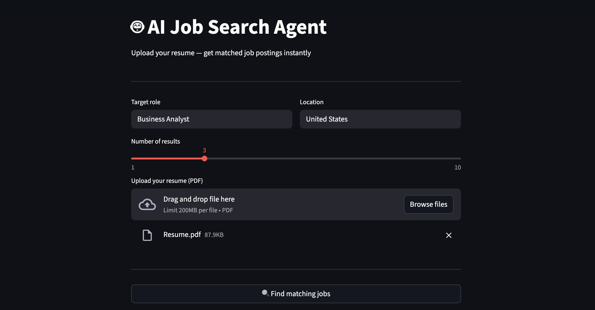
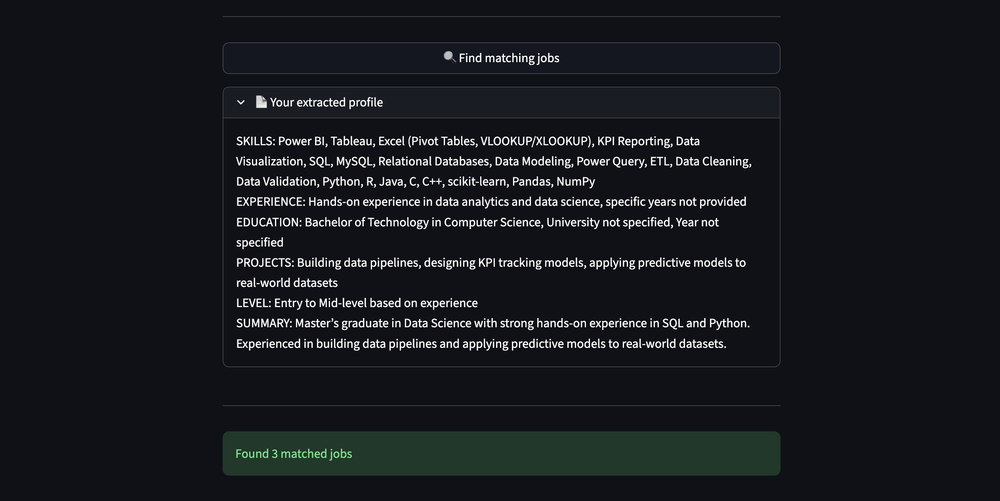
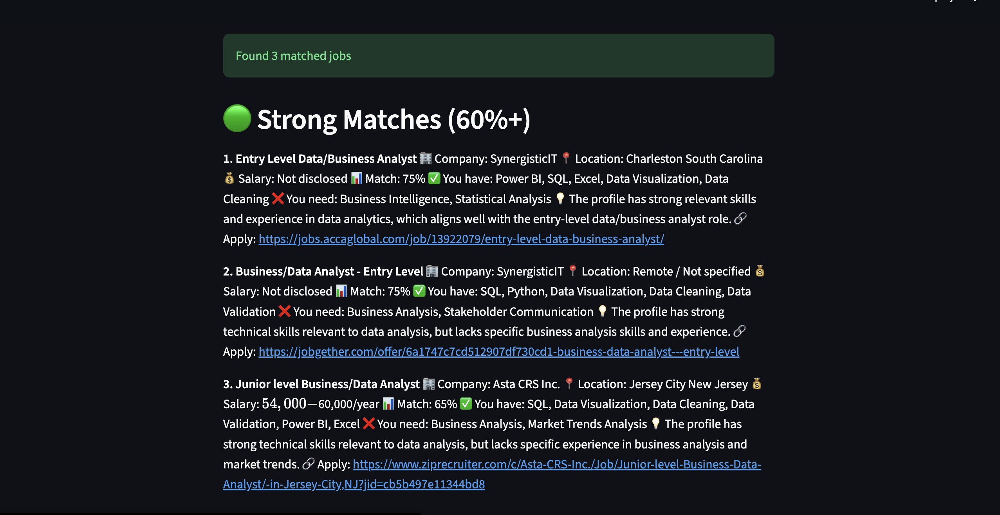

# 🤖 AI-Assisted Job Search Agent

An agentic job search tool that matches your resume against real job postings using LLMs and semantic search.

---

## 🎯 What it does

1. Upload your resume (PDF)
2. Enter your target role and location
3. Agent parses your resume and extracts your profile
4. Searches real job postings via JSearch API
5. Matches each job against your resume using GPT-4o-mini
6. Returns ranked results in 3 tiers:
   - 🟢 Strong match (60%+)
   - 🟡 Partial match (30-59%)
   - 🔴 Fallback (role + location match only)

---

## 🖥️ Demo

### Input — Upload resume and set preferences

### Resume parsing — Extracted profile

### Results — Matched job postings ranked by score

---

## 🛠️ Tech stack

| Tool | Purpose |
|---|---|
| LangChain | LLM orchestration |
| ChromaDB | Vector storage for resume |
| JSearch API | Real job postings |
| GPT-4o-mini | Resume to job matching |
| Streamlit | UI |
| HuggingFace | Sentence embeddings |
| Python | Core language |

---

## ⚙️ Setup

### 1. Clone the repo

git clone https://github.com/ChandraShekar0209/AI-assisted-Job-Search.git
cd AI-assisted-Job-Search

### 2. Create virtual environment

python3 -m venv venv
source venv/bin/activate

### 3. Install dependencies

pip install -r requirements.txt

### 4. Add API keys

cp .env.example .env

Edit .env and add your keys:

OPENAI_API_KEY=your_openai_key_here
RAPIDAPI_KEY=your_rapidapi_key_here

### 5. Run the app

streamlit run app.py

Open your browser at http://localhost:8501

---

## 🔑 API keys needed

| Key | Where to get it |
|---|---|
| OpenAI API key | platform.openai.com |
| RapidAPI key | rapidapi.com — subscribe to JSearch free tier |

---

## 📁 Project structure

AI-assisted-Job-Search/
├── src/
│   ├── __init__.py
│   ├── resume_parser.py    — PDF resume parser with ChromaDB
│   ├── job_search.py       — JSearch API integration
│   ├── job_matcher.py      — LLM resume to job matching
│   └── agent.py            — orchestrates everything
├── app.py                  — Streamlit UI
├── requirements.txt        — all dependencies
├── .env.example            — API key template
├── .gitignore
└── README.md

---

## 🧠 How the matching works

Resume PDF
    │
    ▼
PyPDF loader → ChromaDB → extract profile
    │
    ▼
JSearch API → fetch real job postings
    │
    ▼
GPT-4o-mini → score each job against profile
    │
    ▼
3-tier ranking:
🟢 Strong match (60%+)    → apply today
🟡 Partial match (30-59%) → apply and learn missing skills
🔴 Fallback (0-29%)       → apply based on role and location

---

## 👤 Built by

Chandrashekar Garigapati
MS Data Science — SUNY Albany, Class of 2026
BS Computer Science — SRM University

GitHub: https://github.com/ChandraShekar0209
